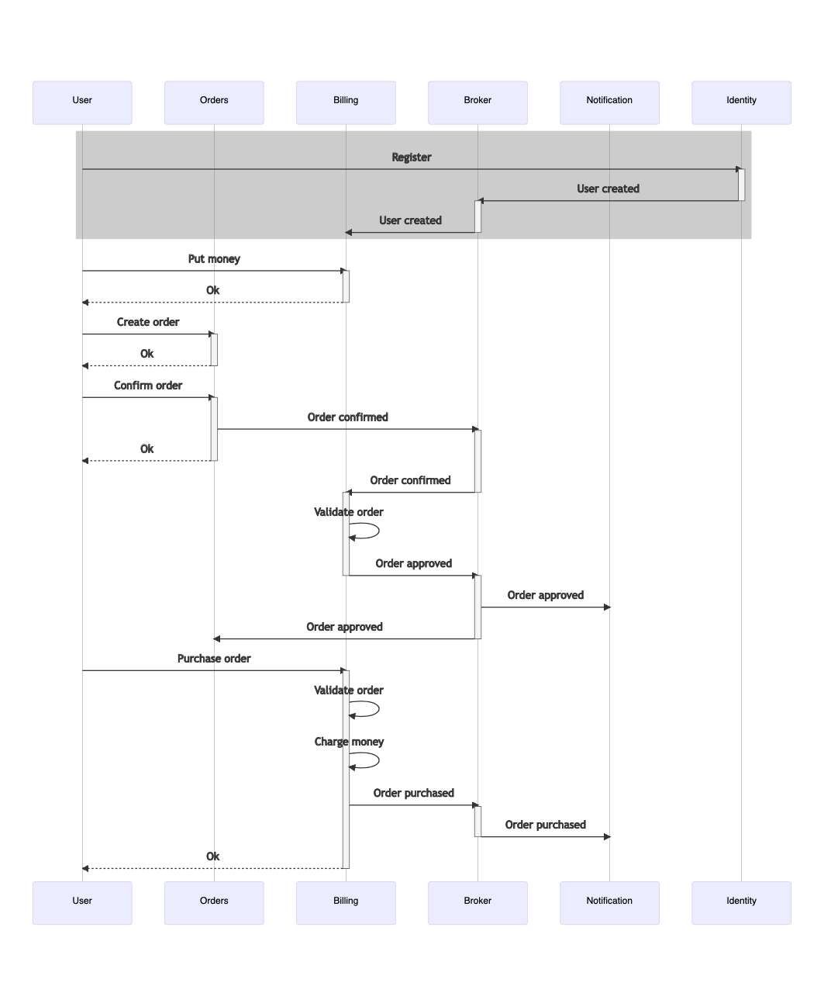

# Stream processing

### Open API:
* [Order service api](https://app.swaggerhub.com/apis/exxbrain/order_service/1.0.0)
* [Billing service api](https://app.swaggerhub.com/apis/exxbrain2/billing_service/1.0.0)

1. Поскольку сервис order-service реализован с использованием принципа event-sourcing, то имеет смысл воспользоваться Event Collaboration, поскольку у нас уже есть необходимое событие Order Confirmed. Схема Event Collaboration: 

2. Схема событийного взаимодействие с использование брокера сообщений для нотификаций (уведомлений). Приводится для того, чтобы просто посмотреть:

