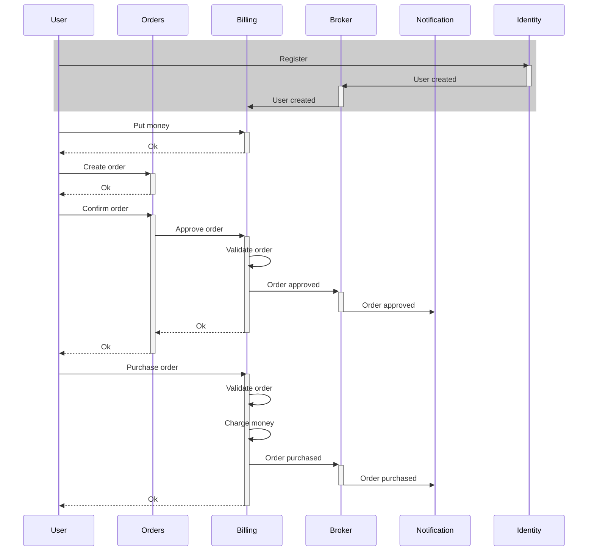

```mermaid
sequenceDiagram
    participant User
    participant Orders
    participant Billing
    participant Broker
    participant Notification
    participant Identity
    rect rgba(0, 0, 0, .2)
        User->>Identity: Register
        activate Identity
            Identity->>Broker: User created
        deactivate Identity
        activate Broker
            Broker->>Billing: User created
        deactivate Broker
    end
    User->>+Billing: Put money
    Billing-->>-User: Ok 
    User->>+Orders: Create order
    Orders-->>-User: Ok
    User->>Orders: Confirm order
    activate Orders
        Orders->>+Billing: Approve order
        Billing->>Billing: Validate order
        Billing->>+Broker: Order approved
        Broker->>-Notification: Order approved
        Billing-->>-Orders: Ok 
        Orders-->>User: Ok
    deactivate Orders
    User->>Billing: Purchase order
    activate Billing
        Billing->>Billing: Validate order
        Billing->>Billing: Charge money
        Billing->>+Broker: Order purchased
        Broker->>-Notification: Order purchased
        Billing-->>User: Ok
    deactivate Billing
```